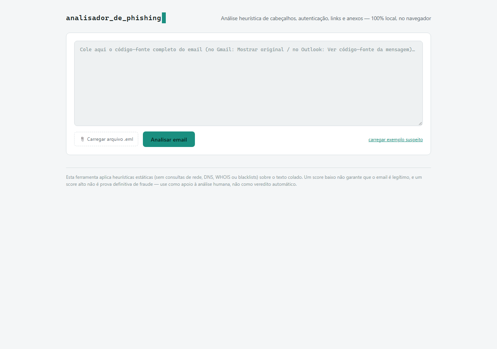
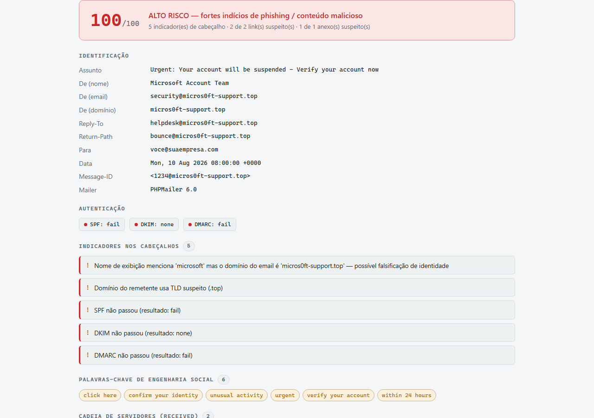
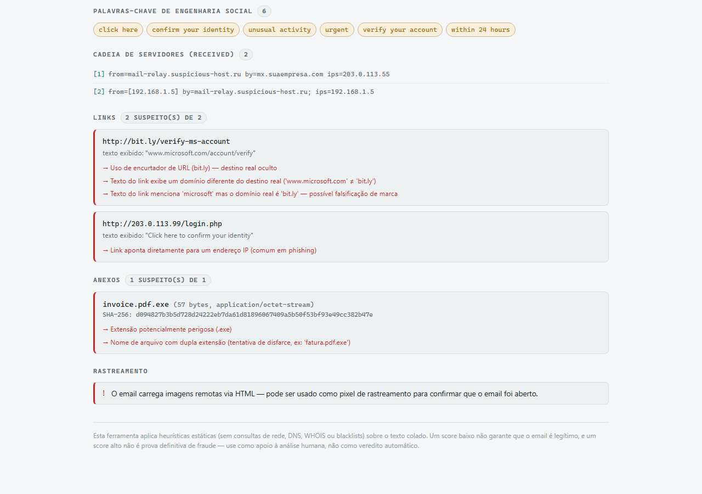

# Analisador de Phishing

Ferramentas para analisar emails em busca de indicadores de phishing/malícia:
remetente real, autenticação (SPF/DKIM/DMARC), cadeia de servidores, links
suspeitos, anexos perigosos e táticas de engenharia social.

Duas versões equivalentes, escolha a que preferir:

| | [`analisador_email_phishing.html`](analisador_email_phishing.html) | [`phishing_analyzer.py`](phishing_analyzer.py) |
|---|---|---|
| Onde roda | No navegador, 100% local | Linha de comando (Python) |
| Entrada | Colar código-fonte do email ou carregar `.eml` | Arquivo `.eml` ou `.msg` |
| Instalação | Nenhuma | Python 3 (+ `extract-msg` opcional) |
| Saída | Relatório visual na página | Relatório em texto + JSON opcional |

Ambas fazem apenas análise **estática e heurística** do conteúdo do email —
nenhuma faz requisições de rede (sem DNS, WHOIS ou consulta a blacklists),
justamente para serem seguras de usar sobre emails potencialmente maliciosos.

## Capturas de ecrã

<p align="center">
  
</p>
<p align="center">
  
  
</p>

> ⚠️ Um score alto é um forte indício, não uma prova definitiva de fraude, e
> um score baixo não garante que o email é legítimo. Use como apoio à
> análise humana, não como veredito automático.

## O que é analisado

- **Identificação**: nome de exibição vs. domínio real do remetente,
  `Reply-To`, `Return-Path`, `Message-ID`, cliente de envio
- **Autenticação**: resultados de SPF, DKIM e DMARC
- **Cadeia de servidores**: todos os saltos `Received`, com IPs de origem
- **Links**: encurtadores de URL, IPs diretos, texto do link ≠ destino real,
  domínios parecidos com o do remetente (typosquatting), TLDs suspeitos
- **Anexos**: extensões perigosas (`.exe`, `.js`, `.hta`, ...), dupla
  extensão disfarçada (`fatura.pdf.exe`), hash SHA-256/MD5
- **Engenharia social**: palavras-chave de urgência/pressão comuns em golpes
- **Rastreamento**: imagens remotas embutidas via HTML (pixel de tracking)

Score de risco de 0 a 100, calculado a partir da soma dos indicadores
encontrados.

---

## 1. Versão web (`analisador_email_phishing.html`)

### Instalação

Nenhuma. É um único arquivo HTML autocontido.

### Uso

1. Abra `analisador_email_phishing.html` em qualquer navegador (duplo clique
   ou `Arquivo > Abrir`).
2. Obtenha o código-fonte bruto do email:
   - **Gmail**: abra o email → menu (⋮) → *Mostrar original*
   - **Outlook**: abra o email → *Arquivo > Propriedades* → campo
     *Cabeçalhos da Internet*, ou *Mais ações > Ver código-fonte da mensagem*
   - **Outlook (nova versão)**: *... > Exibir > Ver código-fonte da mensagem*
3. Cole o texto completo na caixa da página, ou clique em
   **"📎 Carregar arquivo .eml"** para carregar um arquivo já exportado.
4. Clique em **Analisar email**.

Tudo é processado no próprio navegador — nada é enviado para nenhum
servidor.

---

## 2. Script Python (`phishing_analyzer.py`)

### Instalação

Requer Python 3.8+.

```bash
# Opcional, apenas se for analisar arquivos .msg do Outlook:
pip install extract-msg
```

### Uso

```bash
python phishing_analyzer.py caminho\para\email.eml

python phishing_analyzer.py caminho\para\email.msg

# Também salvar o relatório completo em JSON:
python phishing_analyzer.py caminho\para\email.eml --json relatorio.json
```

Como exportar o email:

- **Gmail**: *Mostrar original* → *Baixar original* (gera um `.eml`)
- **Outlook (clássico)**: arraste o email para uma pasta do Windows Explorer
  (gera um `.msg`), ou *Arquivo > Salvar como* escolhendo formato de email
- **Outlook (web/novo)**: *... > Salvar como*

Se não tiver a lib `extract-msg` para arquivos `.msg`, converta o email para
`.eml` antes (a maioria dos clientes de email tem essa opção de exportação).

### Exemplo de saída

```
==============================================================================
 RELATORIO DE ANALISE DE EMAIL - INDICADORES DE PHISHING
==============================================================================

Veredito: ALTO RISCO - fortes indicios de phishing/malicious
Score de risco: 100/100

--- IDENTIFICACAO ---
Assunto      : Urgent: Your account will be suspended - Verify your account now
De (nome)    : Microsoft Account Team
De (email)   : security@micros0ft-support.top
...
```

---

## Limitações

- Não consulta DNS, WHOIS, VirusTotal nem listas de reputação — apenas
  analisa o texto/headers já presentes no email.
- Heurísticas podem gerar falsos positivos (ex: emails legítimos que usam
  encurtadores de URL) e falsos negativos (phishing bem elaborado sem os
  padrões cobertos aqui).
- Não substitui uma ferramenta de segurança corporativa nem a análise de um
  time de segurança.
